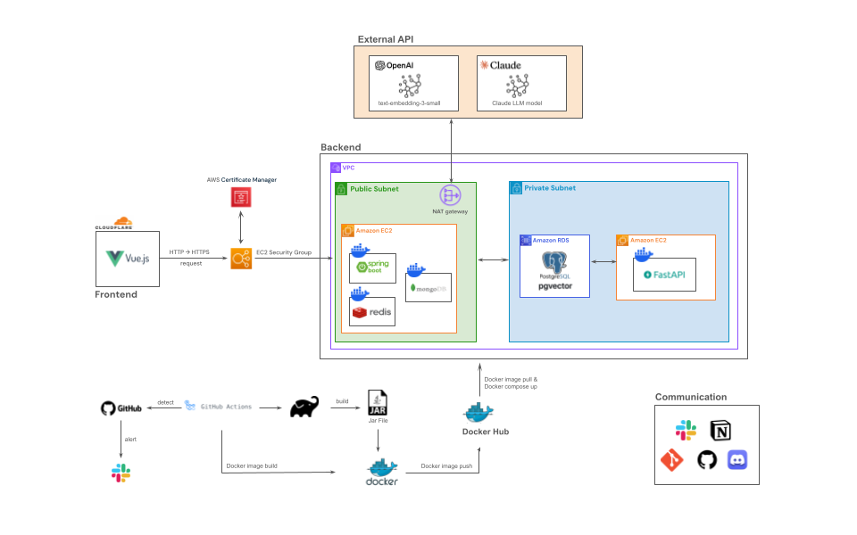

  <h1>Ufit - 통신성향 파악 및 요금제 추천 챗봇</h1>

---

## ✍️ 프로젝트 개요

- **프로젝트명:** Ufit
- **프로젝트 기간:** 2025.6 ~
- **프로젝트 형태:** 기업 연계 프로젝트
- **목표:** 기존 챗봇의 한계를 극복하고, 사용자의 통신성향을 파악 및 요금제 비교추천을 제공하는 LLM 기반 챗봇 서비스 개발

---

## ✍️ 프로젝트 소개

### 프로젝트 배경

1. **정보 탐색의 부담 증가:** 
   - 요금제의 복잡성과 다양성으로 인한 정보 탐색의 부담이 증가함.

2. **기존 챗봇의 한계:** 
   - 고객의 성향, 멤버십 정보 등의 복합적인 니즈를 반영하는 추천을 제공하지 못함.

---

## 🚀 프로젝트 목표

1. **고객의 통신성향 파악:** 
   - 멀티턴 대화를 통해 고객의 통신 성향을 점진적으로 분석.
   - 프롬프트 엔지니어링으로 핵심 정보를 실시간으로 추출하여 고객의 통신 성향 파악.

2. **고객 맞춤형 요금제 추천 제공:** 
   - RAG 기반의 LLM 챗봇을 이용하여 고객의 통화/데이터 사용 패턴, 라이프스타일, 선호도 등을 바탕으로 최적의 요금제 추천.

3. **고객 의사결정 지원 강화:** 
   - 요금제 선택 과정에서 발생하는 정보 탐색 부담을 해소하여 고객이 요금제를 쉽게 비교 및 이해.

---

## 📌 주요 기능

### **1. 회원가입 | 로그인 | 로그아웃**

### **2. 요금제 추천 챗봇**

- LLM을 이용하여 사용자 질문의 도메인 판별
- 사용자의 실제 통신 데이터제 추천에 대한 리뷰 조회
- 각 리뷰가 이루어지기까지의 질문-답변 흐름의 요약과 챗봇이 추천한 요금제의 핵심 내용 제공

### **3. 챗봇의 요금제 추천에 대한 리뷰**
 - 요금제 추천 시 사용자에게 추천에 대한 만족도
 - 요금제 추천에 대한 최대 300자 이내의 텍스트 리뷰
 - 금칙어(욕설, 해킹) 필터링

### **4. 관리자의 요금제 관리**
 - 요금제 상품 등록 및 삭제
 - 인기 있는 요금제 상품을 지표(막대그래프)로 조회

### **5. 관리자의 챗봇 요금제 추천에 대한 리뷰 조회**
- 각 리뷰가 이루어지기까지의 질문-답변 흐름의 요약과 챗봇이 추천한 요금제의 핵심 내용 제공
---

## ⚙️ 아키텍처

  

---

## 📕 산출물

| **산출물**    | **다운로드 링크**        | 
|:-----------:|:---------------:|
| 기획안 | [[눈떠보니유플러스개발자]종합프로젝트_기획안.pdf](https://github.com/user-attachments/files/20699705/_.pdf) |
| ERD |[[눈떠보니유플러스개발자]ERD.pdf](https://github.com/user-attachments/files/20699608/ERD.pdf)|
| 요구사항 정의서 (SRS) |[[눈떠보니유플러스개발자]SRS 요구사항 정의서.pdf](https://github.com/user-attachments/files/20699644/SRS.pdf)|
| IA |[[눈떠보니유플러스개발자]IA.pdf](https://github.com/user-attachments/files/20699660/IA.pdf)|
| 유스케이스 다이어그램 |[[눈떠보니유플러스개발자]유스케이스다이어그램.pdf](https://github.com/user-attachments/files/20699645/default.pdf)|
| WBS |[[눈떠보니유플러스개발자]WBS.pdf](https://github.com/user-attachments/files/20699651/WBS.pdf)|

---

## 🛠️ 기술 스택

<table>
  <thead>
    <tr>
      <th>분류</th>
      <th>기술 스택</th>
    </tr>
  </thead>
  <tbody>
    <tr>
      <td>Frontend</td>
      <td>
        
        
        
        
      </td>
    </tr>
    <tr>
      <td>Backend</td>
      <td>
        
        
        
        
        
      </td>
    </tr>
    <tr>
      <td>Database</td>
      <td>
        
        
        
      </td>
    </tr>
    <tr>
      <td>Infra</td>
      <td>
        
        
        
        
      </td>
    </tr>
  </tbody>
</table>

---

## 🧑‍💻 팀원 소개

| **이름**    | **역할**        | 
|:-----------:|:---------------:|
| 권영태      | 팀장, 어드민 대시보드 페이지, 챗봇 리뷰 저장, 어드민 요금제 목록 API, 리뷰 정보 요약(LLM) |
| 김원석      | 로그인 및 요금제 페이지, 로그인 API 및 인증/인가, LLM 멀티턴 엔지니어링 |
| 김희진      | 챗봇 대화 페이지, 챗봇 메시지 다건 조회 API, LLM 프롬프트 엔지니어링, 금칙어 필터링(LLM) | 
| 박기정      | 데이터 전처리              | 
| 이가인      | 어드인 리뷰 페이지, 어드민 요금제 생성/삭제/지표 조회 API, 어드민 챗봇 리뷰 조회 API, 데이터 전처리 | 
| 조윤주      | 어드민 요금제 관리 패이지, 금칙어 필터링(백엔드), 벡터 임베딩(RAG) |
| 한현우      | 요금제 상세 페이지, 요금제 목록 및 상세 API, 데이터 전처리 |
| 황지연      | 챗봇 리뷰 페이지, 챗봇 채팅 메시지 저장 API, 데이터 수정 대응(RAG) | 

