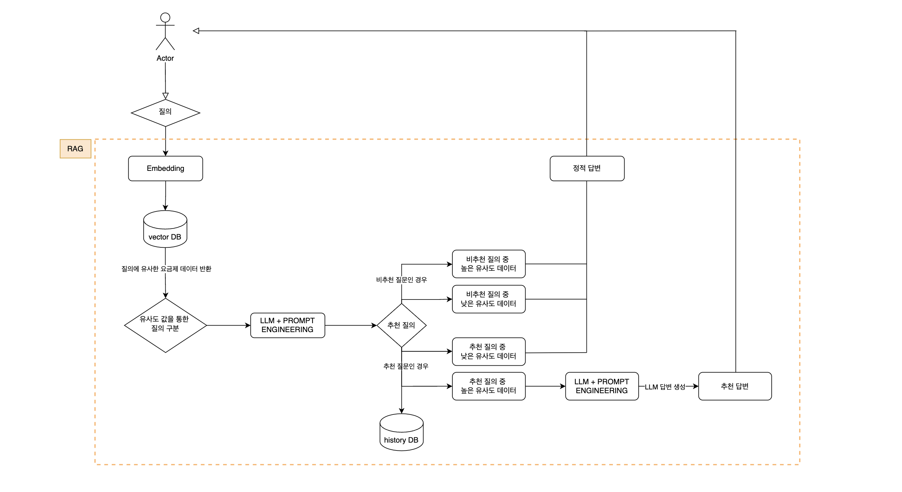

<div align="center">
  <h1>Ufit - 통신성향 파악 및 요금제 추천 챗봇</h1>
</div>

## 1. 프로젝트 개요
### 1-1. 프로젝트 소개  
  - **프로젝트명:** Ufit
  - **프로젝트 기간:** 2025.6 ~ 2025.6 (1M)
  - **프로젝트 형태:** 기업 연계 프로젝트
 
### 1-2. 프로젝트 배경 및 문제 정의
> 1. **정보 탐색의 부담 증가**
>    * 요금제의 복잡성과 다양성으로 인한 정보 탐색의 부담 증가
> 2. **기존 챗봇의 한계**
>    * 고객의 성향, 멤버십 정보 등의 복합적인 니즈를 반영하는 추천을 제공하지 못함  

### 1-3. 목표
 **기존 챗봇의 한계를 극복하고, 사용자의 통신성향을 파악 및 요금제 비교 추천을 제공하는 LLM 기반 챗봇 서비스 개발한다.**

> 1. **고객의 통신성향 파악**
>    * 멀티턴 대화를 통해 고객의 통신 성향을 점진적으로 분석
>    * 프롬프트 엔지니어링으로 핵심 정보를 실시간으로 추출하여 고객의 통신 성향 파악
> 2. **고객 맞춤형 요금제 추천 제공**
>    * RAG 기반의 LLM 챗봇을 이용하여 고객의 통화/데이터 사용 패턴, 라이프스타일, 선호도 등을 바탕으로 최적의 요금제 추천
> 3. **고객 의사결정 지원 강화**
>    * 요금제 선택 과정에서 발생하는 정보 탐색 부담을 해소하여 고객이 요금제를 쉽게 비교 및 이해

### 1-3. 핵심 기능 요약
1.  LLM 기반 질문 응답 및 요금제 추천
2. 추천 결과 리뷰 및 평가 저장
3.  관리자 페이지 통한 요금제/리뷰/통계 관리

<br>

---

## 2. 기술적 특징
  ### 2-1. 아키텍쳐
  본 프로젝트는 **Backend API 서버(Spring Boot)** 와 **LLM 서버(FastAPI)** 를 분리하여 구축했다.
  Spring Boot는 사용자 인증, 요금제 CRUD, 리뷰 저장 등 정형 데이터 처리와 보안에 강점이 있는 영역을 담당하고 있으며, FastAPI는 LangChain, text-embedding-3-small, Claude 등 LLM 및 벡터 검색 최적화 라이브러리를 활용하여 챗봇 응답 생성과 프롬프트 체이닝을 담당한다.
  현재 Spring AI는 기능적으로 LangChain 수준의 유연성과 생태계가 부족하다고 판단되어, LLM 파이프라인은 Python 기반으로 설계되었다.
  
  <br>

  **2-1-1. 시스템 아키텍쳐**
  <div align="center">
    
  </div>

  설명 추가 예정

  **2-1-2. FastAPI <-> Spring 연동 방식** <br>
  
  

  **2-1-3. DB 구조** <br>
  RDB, NoSQL 병행 구조 + 병행 이유 추가 예정

  **2-1-4. 챗봇 추천 흐름도** <br>
    <div align="center">
    
    </div>

  <br>

  **2-1-5. GitHub Actions, CI/CD** 
  
  <br>

  ### 2-2. Frontend

  |사용 기술 |  | 역할 | 사용 이유|
  |:-----------|:-----------|:---------------|:---------------|
  |Vue| |Frontend 화면 구성 |컴포넌트 사용으로 팀 내 UI 통일 용이|
  |Axios| |Frontend Backend 통신 |HTTP 요청/응답을 간단히 처리할 수 있어 API 연동에 용이|
  |Tailwind| | CSS 스타일링 | 빠르게 스타일 적용 가능 |
  |Chat.js| | 요금제 그래프 시각화| 직관적이고 다양한 차트를 쉽게 구현 가능 |

<br>

  ### 2-3. Backend

  |사용 기술 |  |역할|사용 이유|
  |:-----------|:-----------|:---------------|:---------------|
  |SpringBoot| | Backend FrameWork | REST API 구축과 의존성 관리가 용이|
  |JAVA|  | Backend 언어| 안정성과 대규모 서비스에 적합 |
  |Gradle| |프로젝트 build 관리 | Build 자동화 및 의존성 관리에 용이 |
  |JUnit| | 단위 테스트 FrameWork | 코드 안정성과 회귀 테스트 보장을 위해 사용 |

<br>

  ### 3-4. LLM

  |사용 기술 |  | 역할 | 사용 이유 |
  |:-----------|:-----------|:---------------|:---------------|
  |FastAPI|  | LLM Server | 경량 API 서버로 개발에 용이|
  |Python|  | LLM 로직 구현 | 풍부한 NLP 생태계와 다양한 라이브러리 지원 |
  |text-embedding-3-small |  | 임베딩 모델 | ada 모델 대비 뛰어난 성능과 낮은 가격|
  |Claude| |답변 생성, 대화 내용 요약| 한국어 질의를 잘 판단하고, 자연스러운 한국어 어투로 답변 생성에 강점|
  |Langchain|  |RAG 구성, 금칙어 처리| RAG 파이프라인 구성과 프롬포트 체인 구성에 용이 |

<br>

  ### 3-5. DataBase
  |사용 기술 |  | 역할 | 사용 이유 |
  |:-----------|:-----------|:---------------|:---------------|
  |MongoDB|  | 요금제 정보, 챗봇 대화 내용 저장 | 반정형 데이터 저장 용이 |
  |PostgreSQL|  | 유저 관련 정보 저장 |정형 데이터 저장 용이|
  | pgvector |  | 텍스트 임베딩 유사도 검색 | OpenAI 임베딩 결과를 벡터로 저장/검색하기에 최적 |
  | Radis |  | 세션 캐싱 및 응답 속도 개선 | 빠른 조회가 필요한 데이터 캐싱에 유용 |

<br>

 ### 3-6. Infra

  |사용 기술 |  | 역할 | 사용 이유 |
  |:-----------|:-----------|:---------------|:---------------|
  |AWS_EC2|   | 서비스 배포 서버 | 안정적인 서비스 운영과 유연한 인프라 확장 |
  |Docker|  | 컨테이너 환경 | 환경 일관성 유지 및 배포 자동화 |
  |Cloudflare|  | Frontend 배포 | 빠른 CDN 제공 |
  |github actions|   | CI/CD 자동화 | 배포 자동화로 개발 효율성, 생산성 향상 |


<br>

---

## 4. 성능 / 버그 개선
  **4-1. RAG 에서 발생한 문제**

  **4-2. LLM 전환**

  **4-3. 프롬포트 개선**

  **4-4. PI 응답 속도 개선 / 캐싱 전략**

---

## 5. 협업 전략 및 컨벤션 규칙
  ### 5-1. 애자일(Agile) 방법론으로 협업 진행
  본 프로젝트는 **애자일 방법론**을 적용하여 **짧은 반복 개발과 피드백 중심**으로 운영되었다.

  - 매일 오전 10시 **스크럼 회의** 진행 
  - 전일 작업 수행 내용 / 금일 작업 목표 설정 공유 
  - **WBS(Work BreakDown Structure)** 기반 테스크 분배 및 진척 관리
  - 협업 도구: Notion, Google Drive, Slack
  <div>
    
  </div>

  ### 5-2. Git 컨벤션

  효율적인 협업과 충돌 최소화를 위해 컨벤션을 만들고 이에 맞춰 개발을 진행했다.

  **5-2-1.브랜치 네이밍 규칙**

| Prefix | 설명 | 예시 |
|--------|------|------|
| `feat/#` | 새로운 기능 추가 | `feat/#이슈번호-login-api` |
| `fix/#` | 버그 수정 | `fix/#이슈번호-review-error` |
| `refactor/#` | 코드 리팩토링 | `refactor/#이슈번호-chat-service` |
| `docs/` | 문서 작성 및 수정 | `docs/#이슈번호-readme-update` |

<br>

 **5-2-2. 커밋 메시지 규칙**
 
| Prefix | 설명 | 실제 커밋 메시지 |
|--------|------|------|
| `feat: ` | 새로운 기능 추가 | `feat: 요금제 목록/상세 조회 기능 추가 ` |
| `fix: ` | 버그 수정 | `fix: 충돌 해결` |
| `style: ` | 코드 포맷팅, 세미콜론 등 | `style: 코드 컨벤션` |
| `refactor: ` | 코드 리팩토링 | `refactor: MongoDB 의존 클래스 변경` |
| `test: ` | 테스트 코드 추가 | `test: chatBotReview 저장 단위 테스트 추가` |
| `docs: ` | 문서 작성 및 수정 | `docs: update-readme` |
| `chore: ` | 빌드 업무 수정, 패키지 매니저 수정 | `chore: cd script 수정` |

### 5-3. PR 및 코드 리뷰 규칙
본 프로젝트에서는 코드 리뷰를 통해 팀 전체 코드 품질과 일관성을 유지했다.

**5-3-1. PR 원칙**
-	모든 변경은 이슈 및 브렌치 생성 후 PR을 통해 develop 브랜치에 병합
- 본인이 작성한 백엔드 PR은 직접 Merge 금지
- 백엔드 기능은 반드시 팀장 코드 리뷰 후 병합

**5-3-2. GitHub 설정**
-	develop 브랜치에 대해 Require pull request reviews before merging 옵션 사용
- 최소 리뷰어 수: 1명 (팀장은 다른 팀원의 코드 리뷰를 받아야 merge 가능)

**5-3-3. 리뷰 기준**
  - 전반적인 로직, 기능 동작 정확성 점검
  - 컨벤션 준수 여부 (네이밍, 예외 처리, 응답 구조)
  - 보안, 성능, 유지보수성 고려

<br>

### 5-4. DTO, Mapper, 예외 처리 전략

**5-4-1. DTO 및 Mapper 사용** 

- Entity ↔️ DTO 변환은 정적 팩토리 메서드로 수행 (from(), of() 등)

-	Controller에서는 DTO만 사용하여 책임 분리 구현
```
@Override
public ResponseEntity<DeleteRatePlanResponse> deleteRatePlan(String ratePlanId) {
  DeleteRatePlanResponse response = adminService.deleteRatePlan(ratePlanId);
  return ResponseEntity.ok(response);
}
```

**5-4-2. 예외처리 구조**
- 도메인 별 CustomException + ErrorCode(Enum) 사용
```
RATE_PLAN_NOT_FOUND("해당 ratePlanId의 요금제를 찾을 수 없습니다.", HttpStatus.NOT_FOUND),
RATE_PLAN_ALREADY_DELETED("이미 삭제된 요금제입니다.", HttpStatus.BAD_REQUEST);  
```

<br>

### 5-5. 패키지 구조 및 책임 분리

```
🌳 ufit-be/src/main/java/com/ureca/ufit/main
┣ 📂 domain
┃ ┣ 📂chatbot
┃ ┃ ┣ 📂controller    // API 진입 지점
┃ ┃ ┣ 📂dto
┃ ┃ ┃ ┣ 📂request     // 입력 DTO (record)
┃ ┃ ┃ ┣ 📂response    // 출력 DTO (record)
┃ ┃ ┣ 📂exception     // chatbot 도메인 예외
┃ ┃ ┣ 📂repository    // DB 접근
┃ ┃ ┗ 📂service       // 비즈니스 로직
┃ ┣ 📂rateplan
┃ ┣ 📂admin
┃ ┗ 📂user
┣ 📂entity            // JPA Entity
┃ ┣ 📂enums
┣ 📂global
┃ ┣ 📂auth            // 인증/인가 관련
┃ ┣ 📂config          // Spring 및 DB 설정
┃ ┣ 📂domain
┃ ┣ 📂dto
┃ ┣ 📂exception       // 공통 예외 처리
┃ ┣ 📂profanity
┃ ┗ 📂util
┗ 📜UfitApplication.java

```

<br>

---

## 6. 주요 기능 및 UI 스크린샷
### 6-1. 로그인 | 로그아웃
  <div align="center">
    
  </div>

  - 기본 정적 유저 Database에 저장
  - 유저는 관리자와 일반 사용자로 분류

### 6-2. 요금제 추천 챗봇

- LLM을 이용하여 사용자 질문의 도메인 판별
- 사용자의 실제 통신 데이터제 추천에 대한 리뷰 조회
- 각 리뷰가 이루어지기까지의 질문-답변 흐름의 요약과 챗봇이 추천한 요금제의 핵심 내용 제공

### 6-3. 챗봇의 요금제 추천에 대한 리뷰
 - 요금제 추천 시 사용자에게 추천에 대한 만족도
 - 요금제 추천에 대한 최대 300자 이내의 텍스트 리뷰
 - 금칙어(욕설, 해킹) 필터링

### 6-4. 관리자의 요금제 관리
<table align="center">
  <tr>
    <td width="50%">
      <br/>
      <b>요금제 통계 시각화 (그래프)</b>
    </td>
    <td width="50%">
      <br/>
      <b>요금제 등록/삭제 관리 화면</b>
    </td>
  </tr>
</table>


 - 인기 있는 요금제 상품을 지표(막대그래프)로 조회
 - 요금제 상품 등록 및 삭제

### 6-5. 관리자의 챗봇 요금제 추천에 대한 리뷰 조회
- 각 리뷰가 이루어지기까지의 질문-답변 흐름의 요약과 챗봇이 추천한 요금제의 핵심 내용 제공


---

# 7. 팀원 소개

| **이름**    | **역할**        | 
|:-----------:|:---------------:|
| 권영태      | 팀장, 어드민 대시보드 페이지, 챗봇 리뷰 저장, 어드민 요금제 목록 API, 리뷰 정보 요약(LLM) |
| 김원석      | 로그인 및 요금제 페이지, 로그인 API 및 인증/인가, LLM 멀티턴 엔지니어링 |
| 김희진      | 챗봇 대화 페이지, 챗봇 메시지 다건 조회 API, LLM 프롬프트 엔지니어링, 금칙어 필터링(LLM) | 
| 박기정      | 데이터 전처리              | 
| 이가인      | 어드인 리뷰 페이지, 어드민 요금제 생성/삭제/지표 조회 API, 어드민 챗봇 리뷰 조회 API, 데이터 전처리 | 
| 조윤주      | 어드민 요금제 관리 패이지, 금칙어 필터링(백엔드), 벡터 임베딩(RAG) |
| 한현우      | 요금제 상세 페이지, 요금제 목록 및 상세 API, 데이터 전처리 |
| 황지연      | 챗봇 리뷰 페이지, 챗봇 채팅 메시지 저장 API, 데이터 수정 대응(RAG) | 

<br>

---

# 8. 산출물
| **산출물**    | **다운로드 링크**        | 
|:-----------:|:---------------:|
| 기획안 | [[눈떠보니유플러스개발자]종합프로젝트_기획안.pdf](https://github.com/user-attachments/files/20699705/_.pdf) |
| ERD |[[눈떠보니유플러스개발자]ERD.pdf](https://github.com/user-attachments/files/20699608/ERD.pdf)|
| 요구사항 정의서 (SRS) |[[눈떠보니유플러스개발자]SRS 요구사항 정의서.pdf](https://github.com/user-attachments/files/20699644/SRS.pdf)|
| IA |[[눈떠보니유플러스개발자]IA.pdf](https://github.com/user-attachments/files/20699660/IA.pdf)|
| 유스케이스 다이어그램 |[[눈떠보니유플러스개발자]유스케이스다이어그램.pdf](https://github.com/user-attachments/files/20699645/default.pdf)|
| WBS |[[눈떠보니유플러스개발자]WBS.pdf](https://github.com/user-attachments/files/20699651/WBS.pdf)|


# 9. 참고자료


---
