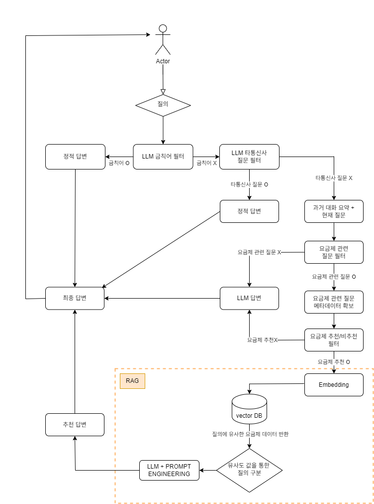

<div align="center">
  <h1>Ufit - 통신성향 파악 및 요금제 추천 챗봇</h1>
</div>

# 1. 프로젝트 개요
## 1-1. 프로젝트 소개  
  - **프로젝트명:** Ufit
  - **프로젝트 기간:** 2025.6 ~ 2025.6 (1M)
  - **프로젝트 형태:** 기업 연계 프로젝트
 
## 1-2. 프로젝트 배경 및 문제 정의
> 1. **정보 탐색의 부담 증가**
>    * 요금제의 복잡성과 다양성으로 인한 정보 탐색의 부담 증가
> 2. **기존 챗봇의 한계**
>    * 고객의 성향, 멤버십 정보 등의 복합적인 니즈를 반영하는 추천을 제공하지 못함  

## 1-3. 목표
 ### 기존 챗봇의 한계를 극복하고, 사용자의 통신성향을 파악하고 요금제 비교 추천을 제공하는 LLM 기반 챗봇 서비스 개발한다.

  ### 세부 목표
> 1. **고객의 통신성향 파악**
>    * 멀티턴 대화를 통해 고객의 통신 성향을 점진적으로 분석
>    * 프롬프트 엔지니어링으로 핵심 정보를 실시간으로 추출하여 고객의 통신 성향 파악
> 2. **고객 맞춤형 요금제 추천 제공**
>    * RAG 기반의 LLM 챗봇을 이용하여 고객의 통화/데이터 사용 패턴, 라이프스타일, 선호도 등을 바탕으로 최적의 요금제 추천
> 3. **고객 의사결정 지원 강화**
>    * 요금제 선택 과정에서 발생하는 정보 탐색 부담을 해소하여 고객이 요금제를 쉽게 비교 및 이해

## 1-3. 핵심 기능 요약
1. **LLM 기반 질문 응답 및 요금제 추천**
2. **추천 결과 리뷰 및 평가 저장**
3. **관리자 페이지 통한 요금제/리뷰/통계 관리**

<br>

---

# 2. 기술적 특징
  ## 2-1. 아키텍쳐
  본 프로젝트는 **Backend API 서버(Spring Boot)** 와 **LLM 서버(FastAPI)** 를 분리하여 구축했다.
  Spring Boot는 사용자 인증, 요금제 CRUD, 리뷰 저장 등 정형 데이터 처리와 보안에 강점이 있는 영역을 담당하고 있으며, FastAPI는 LangChain, text-embedding-3-small, Claude 등 LLM 및 벡터 검색 최적화 라이브러리를 활용하여 챗봇 응답 생성과 프롬프트 체이닝을 담당한다.
  현재 Spring AI는 기능적으로 LangChain 수준의 유연성과 생태계가 부족하다고 판단되어, LLM 파이프라인은 Python 기반으로 설계되었다.
  
  <br>

  ### 2-1-1. 시스템 아키텍쳐
  <br>
  <table align="center">
  <tr>
    <td width="50%">
      <div>
      
      <b>시스템 아키텍쳐</b>
      </div>
    </td>
    <td width="50%">
      
      <br/>
      <b>시스템 아키텍쳐 내 Data Flow</b>
    </td>
  </tr>
</table>

  - 클라이언트(Vue)는 API 게이트웨이처럼 Spring 서버에 요청을 보내고, 챗봇 관련 요청은 FastAPI 서버로 프록시 전달된다.
  - 요금제 데이터는 MongoDB / PostgreSQL 등 이중 구조로 저장되며, 벡터 검색용 임베딩은 pgvector 또는 Redis에 캐싱 처리된다.
  -	LLM 서버는 LangChain으로 구성된 RAG 파이프라인을 수행한다.


  ### 2-1-2. FastAPI <-> Spring 연동 방식
  FastAPI와 Spring은 RestTemplate 기반 비동기 HTTP 통신을 수행한다.

  **주요 요청 흐름 - 요금제 삭제**
  > 1. Spring 에서 MongoDB의 요금제 논리적 삭제 수행 <br>
  > 2. Spring 에서 RestTemplate을 사용해 FastAPI 호출 <br>
  > 3. FastAPI에서 pgvector의 요금제 삭제 후 Spring에 삭제 성공 여부 반환 <br>
  > 4. FastAPI에서 요금제 삭제 실패 시 Spring 에서 MongoDB의 요금제 논리적 삭제 취소 <br>

  <br>
  
  

  ### 2-1-3. DB 구조
  ERD 사진
  <br>
  <table align="center">
  <tr>
    <td width="53%">
      <div>
      
      <b>RDB : PostgreSQL</b>
      </div>
    </td>
    <td width="47%">
      
      <br/>
      <b>MongoDB</b>
    </td>
  </tr>
</table>

  - 요금제 데이터는 MongoDB / PostgreSQL 등 이중 구조로 저장되며, 벡터 검색용 임베딩은 pgvector 또는 Redis에 캐싱 처리된다.

  <br>
 
  ### 2-1-4. 챗봇 추천 흐름도
  <br>
    <div align="center">
    
    </div>
  <br>


  ### 2-1-5. 시퀀스 다이어그램
  <table align="center">
  <tr>
    <td width="60%">
      <div>
      
      <b>요금제 관리 시퀀스 다이어그램</b>
      </div>
    </td>
    <td width="40%">
      
      <br/>
      <b>챗봇 시퀀스 다이어그램</b>
    </td>
  </tr>
</table>

**요금제 생성/삭제** <br>
관리자가 요금제 생성/삭제 등을 요청하면 웹 클라이언트는 WAS 역할인 스프링 서버에게 요청을 전달한다. 요청 받은 스프링 서버는 먼저 MongoDB에 데이터를 삽입/삭제하고 요금제 정보 수정 자동 대응화를 위해 VectorDB에도 임베딩 데이터를 업데이트 하도록 구현 되었다.

<br>

**추천 리뷰 생성** <br>
회원/비회원은 챗봇과 1:1 대화를 통해 요금제를 추천 받은 후 추천 정보에 대한 리뷰를 작성할 수 있다. <br> 
사용자가 리뷰와 평점을 작성하면 웹 클라이언트와 WAS를 지나 FastAPI 서버까지 요청이 도달하여 추천 리뷰에 대한 사용자 질의를 요약한다. 요약된 정보를 스프링 서버가 응답받고 리뷰 정보와 함께 MongoDB에 저장한다.
  
  <br>

  # 3. 기술 스택
  ## 3-1. Frontend

  |사용 기술 |  | 역할 | 사용 이유|
  |:-----------|:-----------|:---------------|:---------------|
  |Vue| |Frontend 화면 구성 |컴포넌트 사용으로 팀 내 UI 통일 용이|
  |Axios| |Frontend Backend 통신 |HTTP 요청/응답을 간단히 처리할 수 있어 API 연동에 용이|
  |Chart.js| | 요금제 그래프 시각화| 직관적이고 다양한 차트를 쉽게 구현 가능 |
  |SweetAlert2| | 사용자 알림 모달 | 사용자에게 직관적인 피드백(확인, 경고, 에러 등)을 전달하기 용이 |

<br>

  ## 3-2. Backend

  |사용 기술 |  |역할|사용 이유|
  |:-----------|:-----------|:---------------|:---------------|
  |SpringBoot <br> (ver. 3.3.12)| | Backend FrameWork | REST API 구축과 의존성 관리가 용이|
  |JAVA <br> (ver. 17)|  | Backend 언어| 안정성과 대규모 서비스에 적합 |
  |Gradle| |프로젝트 build 관리 | Build 자동화 및 의존성 관리에 용이 |
  |JUnit| | 단위 테스트 FrameWork | 코드 안정성과 회귀 테스트 보장을 위해 사용 |

<br>

  ## 3-3. LLM

  |사용 기술  |  | 역할 | 사용 이유 |
  |:-----------|:-----------|:---------------|:---------------|
  |FastAPI|  | LLM Server | 경량 API 서버로 개발에 용이|
  |Python <br> (ver. 3.11) |  | 데이터 임베딩, LLM 로직 구현 | 풍부한 NLP 생태계와 다양한 라이브러리 지원 |
  |OpenAI <br> (text-embedding-3-small) |  | 임베딩 모델 | ada 모델 대비 뛰어난 성능과 낮은 가격|
  |Claude <br> (claude-3-haiku-20240307)| |답변 생성, 대화 내용 요약| 일관된 말투, 요약 결과에 뛰어난 성능 |
  |Langchain|  |RAG 구성, 금칙어 처리| PromptTemplate 및 메시지 관리 편의성 |
  |LangGraph|  |RAG |  |

<br>

  ## 3-4. DataBase
  |사용 기술 (버전) |  | 역할 | 사용 이유 |
  |:-----------|:-----------|:---------------|:---------------|
  |MongoDB|  | 요금제 정보, 챗봇 대화 내용 저장 | 구조가 다른 요금제 데이터, 챗봇 메시지 등 비정형 데이터 저장 |
  |PostgreSQL <br> (ver. 16)|  | 유저 관련 정보 저장 | 정형  데이터(ex. 유저, 채팅방) 저장 + pg vector와의 통합 |
  | pgvector < |  | 텍스트 임베딩 유사도 검색 | OpenAI 임베딩 결과를 벡터로 저장/검색하기에 최적 |
  | Radis |  | 세션 캐싱 및 응답 속도 개선 | 리프레시 토큰, 블랙리스트 토큰 관리 |

<br>

 ## 3-5. Infra

|사용 기술 |  | 역할 | 사용 이유 |
|:-----------|:-----------|:---------------|:---------------|
|AWS EC2|  | 서비스 배포 서버 | 안정적인 서비스 운영과 유연한 인프라 확장 |
|AWS RDS|  | 관계형 DB 호스팅 | 관리형 DB로 백업, 보안, 장애 대응 용이 |
|AWS LoadBalancer|  | 트래픽 분산 | 서비스 가용성 및 확장성 확보 |
|Docker|  | 컨테이너 환경 | 환경 일관성 유지 및 배포 자동화 |
|Cloudflare|  | Frontend 배포 | 빠른 CDN 제공 |
|GitHub Actions|  | CI/CD 자동화 | 배포 자동화로 개발 효율성, 생산성 향상 |


<br>

---

# 4. 기술적 고민 및 문제해결
  ## 4-1. 웹소켓 vs. HTTP
  
  | 웹소켓 방식 | HTTP 요청 방식 |
  |:---------|:-------------|
  |* 양방향 소통 <br> * 실시간 상호작용 | * 단방향 요청 <br> * 간헐적 통신 |

  본 프로젝트에서는 
  1. 실시간 채팅이 요구되지 않으며
  2. 챗봇의 응답이 생성되기 전까지 새로운 질문을 생성할 수 없다는 점에서 <br>

  **HTTP 요청 방식을 선택했다.**
  
  <br>

  ## 4-2. RestTemplate vs. WebClient
  ### 4-2-1. 기존 구조 및 가설
  기존 구조는 **RestTemplate (동기 + 블로킹) 방식**을 사용하고 있어, FastAPI 서버로부터 응답이 오기 전까지 스레드가 대기하며 다른 HTTP 작업 처리율이 떨어질 것으로 예상했다. <br>

  따라서, **WebClient (비동기 + 논블로킹) 방식**으로 변경하면 FastAPI 서버 응답이 오기 전까지 다른 HTTP 작업을 처리할 수 있어 성능 개선이 될 것으로 예상했다.
  
  ### 4-2-2.결과
  nGrinder를 이용해 요청을 보내고, Grafana와 Prometheus로 처리 속도를 모니터링해 두 가지 방식을 비교해보았다.

  **테스트 조건 및 결과**

  |              | RestTemplate | WebClient |
  |:-------------|:---------|:---------|
  | **테스트 조건** | 사용자 99명 <br> (실행 시간 3분) | 사용자 99명 <br> (실행 시간 3분) |
  | **TPS (평균/피크)** | 평균 8.4 TPS / 피크 29 | 평균 8.5 TPS / 피크 27 |
  | **평균 응답시간** | 331 ms | 250.87 ms |

<br>

  **정리**

  1. 실제 병목은 SpringBoot가 아닌 **FastAPI** 서버에서 발생했다. <br>
  따라서, FastAPI 서버를 비동기 로직으로 변경해야 성능이 더 향상될 것으로 기대된다.
  2. SpringBoot만으로도 평균 응답시간이 **약 24%** 향상 되었다. <br>
  이를 바탕으로 사용자 수가 수백, 수천명으로 늘어날 경우 더욱 더 큰 성능 향상으로 이어질 것으로 예상된다.

  ## 4-3. Infra 
  <br>
  <div align="center">
  
  </div>
  <br>

• LLM 응답은 평균 수 초 이상 소요되며, 동기식 호출 시 전체 요청 처리에 영향 <br>
• 스프링 기반 백엔드에서 직접 LLM을 호출할 경우, API 응답 지연 + 자원 경쟁이 발생 <br>
• 특히 벡터 임베딩과 DB 저장까지 함께 처리되면서 백엔드의 I/O 병목 심화

<br>

**[변경 후]**

• FastAPI 기반 AI 서버를 별도 컨테이너로 분리 → LLM 요청은 비동기 호출로 위임 <br>
• 스프링부트 서버는 챗 메시지 처리, 유저 관리 등 빠른 응답이 필요한 업무에 집중

  ## 4-4. 데이터 정합성
  **RAG 구조에서 임베딩 기반 추천 결과와 MongoDB 기반 요금제 데이터 간 정합성 확보**

  ### 4-4-1. 기존 구조의 한계
  1. LLM이 백터 DB 에서 추천한 요금제는 MongoDB에 저장된 요금제와 매핑이 불가능 => 정합성 부족 문제 발생
  2. 응답에 Object id가 없어 상세 페이지 연결, 리뷰 저장, 요금제 추천 등에 연속성 단절 발생

  ### 4-4-2. 문제 해결 시 고려 방안
  1. **요금제 이름을 key로 삼아 조회** <br>
    요금제 이름은 unique하지 않기 때문에 key로 사용하기엔 부적절
  2. **문서 생성 시점의 타임스탬프 기반 추적** <br>
    시간 순서로 할 경우 매칭이 불안정하고 유지 보수에 어려움 발생

  ### 4-4-3. 결론
  
  **Mongo DB 요금제 데이터의 Object ID를 메타데이터 내부에 매핑 후 저장**

  **결과** <br>
  검색-추천-상세보기-분석까지 이어지는 전 과정을 단일 키 기반으로 정합성 있게 설계 <br>
  RAG 시스템의 운영 관점에서는 'retrieved document의 추적 가능성'을 보장

<br>
<br>

# 5. 협업 전략 및 컨벤션 규칙
  ## 5-1. 애자일(Agile) 방법론으로 협업 진행
  본 프로젝트는 **애자일 방법론**을 적용하여 **짧은 반복 개발과 피드백 중심**으로 운영되었다.

  - 매일 오전 10시 **스크럼 회의** 진행 
  - 전일 작업 수행 내용 / 금일 작업 목표 설정 공유 
  - **WBS(Work BreakDown Structure)** 기반 테스크 분배 및 진척 관리
  - 협업 도구: Notion, Google Drive, Slack

  <table align="center">
  <tr>
    <td width="50%">
      <div>
      
      <b>WBS (Work BreakDown Structure)</b>
      </div>
    </td>
    <td width="50%">
      
      <br/>
      <b>회의록</b>
    </td>
  </tr>
</table>


  ## 5-2. Git 컨벤션

  효율적인 협업과 충돌 최소화를 위해 컨벤션을 만들고 이에 맞춰 개발을 진행했다.

  ### 5-2-1.브랜치 네이밍 규칙

| Prefix | 설명 | 예시 |
|--------|------|------|
| `feat/#` | 새로운 기능 추가 | `feat/#이슈번호-login-api` |
| `fix/#` | 버그 수정 | `fix/#이슈번호-review-error` |
| `refactor/#` | 코드 리팩토링 | `refactor/#이슈번호-chat-service` |
| `docs/` | 문서 작성 및 수정 | `docs/#이슈번호-readme-update` |

<br>

 ### 5-2-2. 커밋 메시지 규칙
 
| Prefix | 설명 | 실제 커밋 메시지 |
|--------|------|------|
| `feat: ` | 새로운 기능 추가 | `feat: 요금제 목록/상세 조회 기능 추가 ` |
| `fix: ` | 버그 수정 | `fix: 충돌 해결` |
| `style: ` | 코드 포맷팅, 세미콜론 등 | `style: 코드 컨벤션` |
| `refactor: ` | 코드 리팩토링 | `refactor: MongoDB 의존 클래스 변경` |
| `test: ` | 테스트 코드 추가 | `test: chatBotReview 저장 단위 테스트 추가` |
| `docs: ` | 문서 작성 및 수정 | `docs: update-readme` |
| `chore: ` | 빌드 업무 수정, 패키지 매니저 수정 | `chore: cd script 수정` |

<br>

## 5-3. PR 및 코드 리뷰 규칙
본 프로젝트에서는 코드 리뷰를 통해 팀 전체 코드 품질과 일관성을 유지했다.

### 5-3-1. PR 원칙
-	모든 변경은 이슈 및 브렌치 생성 후 PR을 통해 develop 브랜치에 병합
- 본인이 작성한 백엔드 PR은 직접 Merge 금지
- 백엔드 기능은 반드시 팀장 코드 리뷰 후 병합

### 5-3-2. GitHub 설정
-	develop 브랜치에 대해 Require pull request reviews before merging 옵션 사용
- 최소 리뷰어 수: 1명 (팀장은 다른 팀원의 코드 리뷰를 받아야 merge 가능)

### 5-3-3. 리뷰 기준
  - 전반적인 로직, 기능 동작 정확성 점검
  - 컨벤션 준수 여부 (네이밍, 예외 처리, 응답 구조)
  - 보안, 성능, 유지보수성 고려

<br>

## 5-4. DTO, Mapper, 예외 처리 전략

### 5-4-1. DTO 및 Mapper 사용

**Entity ↔️ DTO 변환은 XXMapper.toXXX() 방식**
  - Entity는 DTO 둘 다 서로를 알 필요가 없음

**Entity 생성은 생성자와 빌더가 아닌 정적 팩토리 메서드로 수행**
  - Java 오버로딩 이용
  - 매 객체 생성 시 직접 빌더를 이용하면 휴먼에러 발생 가능성 -> 정적 팩토리 메서드를 통해 일부 방지

**DTO는 record type으로 생성**
  - 모든 필드의 final, Getter, toString() .. 자동 생성 이점
  - 불변성 -> 멀티스레드 환경의 안전성 증가
  - 데이터를 담는 용도인 DTO는 주로 불변성을 갖는 점을 고려

**Controller에서는 DTO만 사용하여 책임 분리 구현**
```
@Override
public ResponseEntity<DeleteRatePlanResponse> deleteRatePlan(String ratePlanId) {
  DeleteRatePlanResponse response = adminService.deleteRatePlan(ratePlanId);
  return ResponseEntity.ok(response);
}
```

<br>

### 5-4-2. 예외처리 구조
- 도메인 별 CustomException + ErrorCode(Enum) 사용
```
RATE_PLAN_NOT_FOUND("해당 ratePlanId의 요금제를 찾을 수 없습니다.", HttpStatus.NOT_FOUND),
RATE_PLAN_ALREADY_DELETED("이미 삭제된 요금제입니다.", HttpStatus.BAD_REQUEST);  
```

<br>

## 5-5. 백엔드 패키지 구조 및 책임 분리

```
🌳 ufit-be/src/main/java/com/ureca/ufit/main
┣ 📂 domain
┃ ┣ 📂chatbot
┃ ┃ ┣ 📂controller    // API 진입 지점
┃ ┃ ┣ 📂dto
┃ ┃ ┃ ┣ 📂request     // 입력 DTO (record)
┃ ┃ ┃ ┣ 📂response    // 출력 DTO (record)
┃ ┃ ┣ 📂exception     // chatbot 도메인 예외
┃ ┃ ┣ 📂repository    // DB 접근
┃ ┃ ┗ 📂service       // 비즈니스 로직
┃ ┣ 📂rateplan
┃ ┣ 📂admin
┃ ┗ 📂user
┣ 📂entity            // JPA Entity
┃ ┣ 📂enums
┣ 📂global
┃ ┣ 📂auth            // 인증/인가 관련
┃ ┣ 📂config          // Spring 및 DB 설정
┃ ┣ 📂domain
┃ ┣ 📂dto
┃ ┣ 📂exception       // 공통 예외 처리
┃ ┣ 📂profanity
┃ ┗ 📂util
┗ 📜UfitApplication.java

```

<br>

---

# 6. 주요 기능 및 UI 스크린샷
## 6-1. 로그인 | 로그아웃

<table align="center">
  <tr>
    <td width="60%">
      <br/>
    
      <b>로그인 화면</b>
    </td>
    <td width="50%">
    </td>
  </tr>
</table>
  - 기본 정적 유저 Database에 저장
  - 유저는 관리자와 일반 사용자로 분류

## 6-2. 요금제 추천 챗봇
<table align="center">
  <tr>
    <td width="50%">
       <br>
      <b>요금제 추천</b>
    </td>
    <td width="50%">
    </td>
  </tr>
</table>

- LLM을 이용하여 사용자 질문의 도메인 판별
- 사용자의 실제 통신 성향 분석
- 요금제 추천 제공 후 챗봇 리뷰 작성
- 각 리뷰가 이루어지기까지의 질문-답변 흐름의 요약과 챗봇이 추천한 요금제의 핵심 내용 제공

<br>

## 6-3. 챗봇의 요금제 추천에 대한 리뷰

 - 요금제 추천 시 사용자에게 추천에 대한 만족도
 - 요금제 추천에 대한 최대 300자 이내의 텍스트 리뷰
 - 금칙어(욕설, 해킹) 필터링

<br>

## 6-4. 관리자의 요금제 관리
<table align="center">
  <tr>
    <td width="50%">
      <br/>
      <b>요금제 통계 시각화 (그래프)</b>
    </td>
    <td width="50%">
      <br/>
      <b>요금제 등록/삭제 관리 화면</b>
    </td>
  </tr>
</table>

 - 인기 있는 요금제 상품을 지표(막대그래프)로 조회
 - 요금제 상품 등록 및 삭제

<br>

## 6-5. 관리자의 챗봇 요금제 추천에 대한 리뷰 조회
<table align="center">
  <tr>
    <td width="60%">
       <br>
      <b> 챗봇 리뷰 조회</b>
    </td>
    <td width="40%">
      <br>
    </td>
  </tr>
</table>

- 각 리뷰가 이루어지기까지의 질문-답변 흐름의 요약과, 챗봇이 추천한 상품의 핵심 내용을 함께 제공
- 리뷰 평점과 텍스트 리뷰는 원문으로 조회

<br>

---

# 7. 팀원 소개

<table>
  <thead>
    <tr>
      <th >GitHub</th>
      <th>이름</th>
      <th>역할</th>
      <th>Backend</th>
      <th>Frontend</th>
      <th>LLM</th>
    </tr>
  </thead>
  <tbody>
    <tr>
      <td align="center">
        <a href="https://github.com/dudxo">
           <br>@dudxo
        </a>
      </td>
      <td><strong>권영태</strong></td>
      <td><strong>팀장 <br> Backend 고도화 리더 </td>
      <td>- 개발 환경 구축<br>- 어드민 요금제 목록<br>- 챗봇 리뷰 저장</td>
      <td>어드민 요금제 목록 페이지</td>
      <td>리뷰 정보 요약</td>
    </tr>
    <tr>
      <td align="center">
        <a href="https://github.com/dnjstjt1297">
           <br>@dnjstjt1297
        </a>
      </td>
      <td><strong>김원석</strong></td>
      <td><strong>Backend 보안 관리자</strong></td>
      <td>로그인 API 및 인증/인가</td>
      <td>로그인 페이지</td>
      <td>프롬프트 엔지니어링</td>
    </tr>
    <tr>
      <td align="center">
        <a href="https://github.com/heejjinkim">
           <br>@heejjinkim
        </a>
      </td>
      <td><strong>김희진</strong></td>
      <td><strong>서기</strong></td>
      <td>챗봇 메시지 다건 조회 API</td>
      <td>- 개발 환경 구축<br>- 챗봇 메시지 페이지</td>
      <td>- 프롬프트 엔지니어링<br>- 금칙어 필터링</td>
    </tr>
    <tr>
      <td align="center">
        <a href="https://github.com/ParkKiJung">
           <br>@ParkKiJung
        </a>
      </td>
      <td><strong>박기정</strong></td>
      <td><strong>QA</strong></td>
      <td>사용 기술 스택 정리</td>
      <td>사용 기술 스택 정리</td>
      <td>데이터 전처리</td>
    </tr>
    <tr>
      <td align="center">
        <a href="https://github.com/LGAIN">
           <br>@LGAIN
        </a>
      </td>
      <td><strong>이가인</strong></td>
      <td><strong>산출물 관리</strong></td>
      <td>- 어드민 요금제 생성/삭제<br>- 요금제 지표 조회<br>- 챗봇 리뷰 조회</td>
      <td>챗봇 리뷰 어드민 페이지</td>
      <td>- 개발 환경 구축<br>- 데이터 전처리</td>
    </tr>
    <tr>
      <td align="center">
        <a href="https://github.com/choyunju">
           <br>@choyunju
        </a>
      </td>
      <td><strong>조윤주</strong></td>
      <td><strong>서기</strong></td>
      <td>- 금칙어 필터링 <br> - 벡터 임베딩</td>
      <td>어드민 요금제 관리 페이지</td>
      <td>금칙어 필터링</td>
    </tr>
    <tr>
      <td align="center">
        <a href="https://github.com/Eric-HAN-01">
           <br>@Eric-HAN-01
        </a>
      </td>
      <td><strong>한현우</strong></td>
      <td><strong>스크럼 마스터</strong></td>
      <td>요금제 목록 및 상세 API</td>
      <td>요금제 상세 페이지</td>
      <td>데이터 전처리</td>
    </tr>
    <tr>
      <td align="center">
        <a href="https://github.com/ghkdwldus0807">
           <br>@ghkdwldus0807
        </a>
      </td>
      <td><strong>황지연</strong></td>
      <td><strong>인프라 담당</strong></td>
      <td>챗봇 메시지 저장 API</td>
      <td>챗봇 리뷰 페이지</td>
      <td>요금제 데이터 수정 대응</td>
    </tr>
  </tbody>
</table>
<br>

---

# 8. 산출물
| **산출물**    | **다운로드 링크**        | 
|:-----------:|:---------------:|
| 기획안 | [[눈떠보니유플러스개발자]종합프로젝트_기획안.pdf](https://github.com/user-attachments/files/20699705/_.pdf) |
| ERD |[[눈떠보니유플러스개발자]ERD.pdf](https://github.com/user-attachments/files/20699608/ERD.pdf)|
| 요구사항 정의서 (SRS) |[[눈떠보니유플러스개발자]SRS 요구사항 정의서.pdf](https://github.com/user-attachments/files/20699644/SRS.pdf)|
| IA |[[눈떠보니유플러스개발자]IA.pdf](https://github.com/user-attachments/files/20699660/IA.pdf)|
| 유스케이스 다이어그램 |[[눈떠보니유플러스개발자]유스케이스다이어그램.pdf](https://github.com/user-attachments/files/20699645/default.pdf)|
| WBS |[[눈떠보니유플러스개발자]WBS.pdf](https://github.com/user-attachments/files/20699651/WBS.pdf)|

<br>

# 9. 참고자료


---
